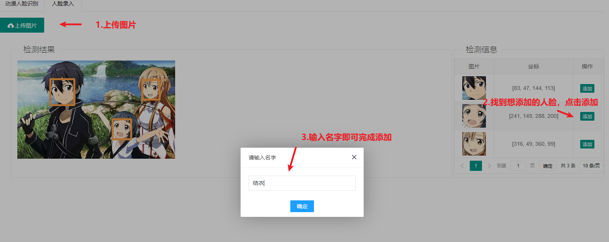
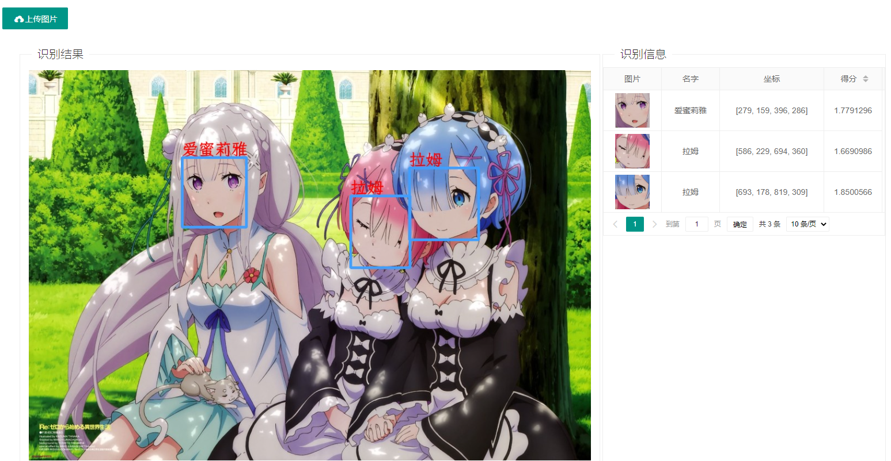
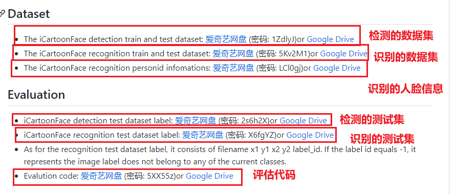
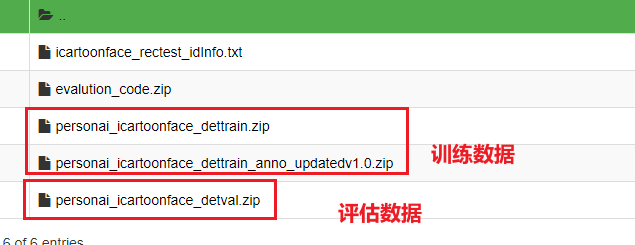
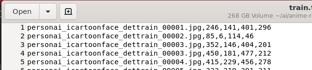
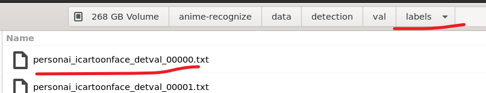
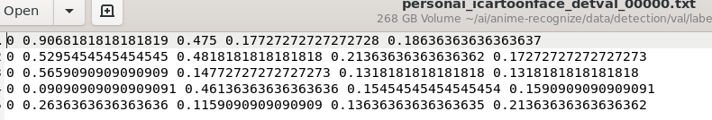
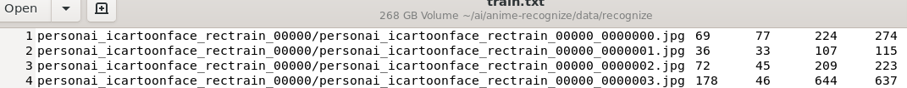
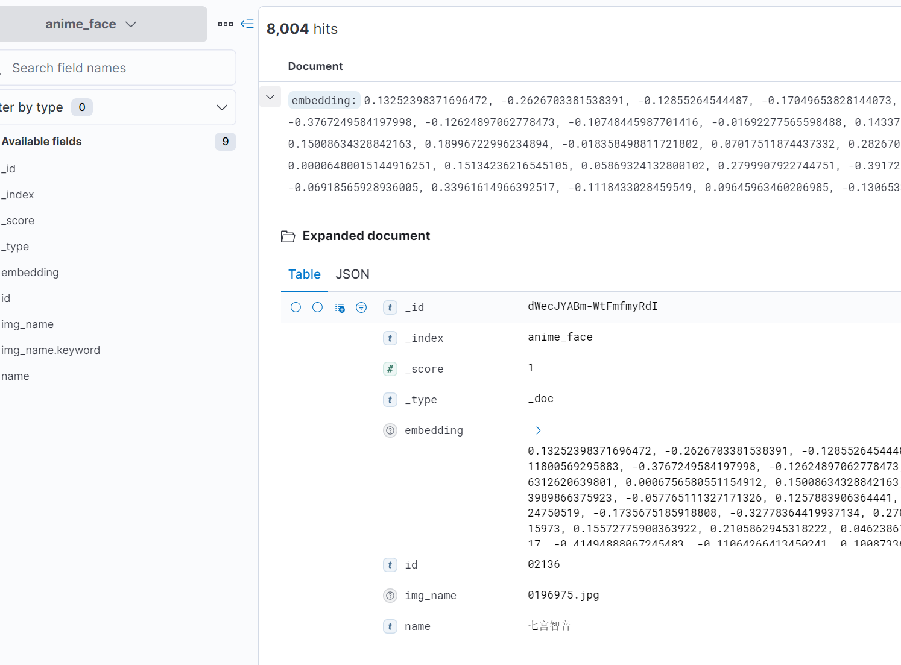

# 动漫人脸识别项目

> 欢迎关注B站：https://space.bilibili.com/343147393

## 视频介绍
B站：https://www.bilibili.com/video/BV1tS4y1Y7gc

## 效果展示
### 人脸录入

### 人脸识别


## 数据集准备

数据集地址：https://github.com/luxiangju-PersonAI/iCartoonFace

数据集包括两个部分检测部分和识别部分



### 人脸检测的数据集准备
我们先看一下检测的数据集



测试的数据在那个识别的数据集里面


测试集标签是下面这个


我们对这些数据进行整理，整理出的格式如下，比如我们训练的图片放在`train/images`里去，其他的一样。
```
├── test
│   ├── images
│   └── labels
├── train
│   ├── images
│   └── labels
├── val
│   ├── images
│   └── labels
├── test.txt
├── train.txt
└── val.txt
```
然后`train.txt`等几个txt就是所有图片的坐标信息了，我们先全部转换下面这样的格式，图片和坐标之间使用逗号隔开



当然，这种的格式不能被YOLOV5识别，我们可以参考 https://github.com/ultralytics/yolov5/wiki/Train-Custom-Data 来设置自己的数据集

这里我写了一个脚本可以把我们这种格式的数据转换为yolov5的格式。转换前自己要确保我们这个检测的数据集在 `data/detection` 下。具体可以自己看看脚本内容
```bash
cd tool
python set_yolo_label.py
```

转换后，我们就可以看到labels目录下有很多文本文件，一个图片对应一个文本文件，具体如下



里面的文本文件格式如下



### 人脸识别数据集准备

人脸识别我采用的 https://github.com/siriusdemon/Build-Your-Own-Face-Model/tree/master/recognition 项目。
我们需要先准备一下数据集，这里暂时不需要测试数据，我们直接训练即可。

目录如下，train里面放所有待训练的图片，train.txt就是我们待训练的数据了
```
.
├── images
├── train
└── train.txt
```

`train.txt` 的格式如下



因为原始图片是没有裁剪过的，我们需要根据`train.txt`的文件进行裁剪，使用下面的命令快速对图片进行裁剪

> 这个函数会对图片进行缩放,全部设置为`250*250`大小的图片，如果不想缩放，那么就自己去注释代码里面的对应内容即可

```bash
cd tool
python process_recognize.py
```

处理完后格式如下，每个人物都有对应的编号，每个编号对应一个文件夹，对应的文件夹就是这个编号所有的图片了
```
.
├── images
│   ├── 00000
│   ├── 00001

```

## 模型训练

### yolov5 模型训练

```bash
# 首先我们克隆一下yolov5项目
git clone https://github.com/ultralytics/yolov5.git
cd yolov5
# 需要注意，我们需要修改models下yolov5m.yaml的nc=1，表示我们只有一个类别。如果你选择的其他模型，也是一样的
# 开始训练我们的数据集，如果爆显存可以把batch改小一点，如果不想迭代这么久可以把epochs改小一点
python train.py --batch 16 --epochs 50 --data ../dataset.yaml --weights yolov5m.pt
```

训练完后我们 `runs/train/exp*/weights`里面，我们直接使用 `best.pt` 模型就可以了

### 人脸识别模型训练

所有的配置都在 `core/recognize/config.py` 里面，大家修改一下即可，修改完毕后我们直接开始训练

```bash
python arce_face_train.py
```

训练完后会在 `checkpoints` 下生成很多 `*.pth` 的模型，我们直接使用最后一个就可以了。

## 数据存储

人脸识别实际上就是特征匹配，每个人脸都有自己对应的特征，判断两个人脸是否一致可以使用向量距离来计算。
一般常用的有余弦距离等。。

### 存储引擎

首先我们需要先计算出所有人物的特征信息，并存储，这里我使用的是ES。使用下面的命令来创建一个ES索引，其中`dense_vector`表示我们这个字段是一个向量。然后维度是512
```
PUT anime_face
{
  "mappings": {
    "properties": {
      "id" : {
        "type" : "keyword"
      },
      "name" : {
        "type" : "keyword"
      },
      "img_name" : {
        "type" : "keyword"
      },
      "embedding": {
        "type": "dense_vector",
        "dims": 512
      }
    }
  }
}
```

ES相关的代码都在 `core/es` 里面，记得修改成自己的ES地址就可以了

我们可以使用如下的ES语句来进行查询，下面这个是计算向量的相似度并进行排序
```
GET anime_face/_search
{
  "query": {
    "script_score": {
      "query": {
        "match_all": {}
      },
      "script": {
        "source": "cosineSimilarity(params.query_vector, 'embedding') + 1.0",
        "params": {
          "query_vector": [
     0.12529310584068298, 0.2548443377017975, -0.2656480073928833, -0.3156413733959198, -0.328787237405777, -0.09251327067613602, 0.42978963255882263, -0.2667100429534912, -0.1436472088098526, 0.41181883215904236, -0.2656635642051697, -0.21636728942394257, 0.2061954140663147, 0.1103983148932457, -0.3254120945930481, -0.4391513764858246, -0.16024106740951538, -0.0295660812407732, 0.09242014586925507, -0.05342010036110878, -0.07047661393880844, 0.12785033881664276, 0.06978322565555573, -0.32929718494415283, -0.2562639117240906, -0.25788119435310364, -0.20642977952957153, 0.040526147931814194, 0.22241632640361786, 0.013408379629254341, -0.053290847688913345, 0.3317338824272156, -0.15591800212860107, -0.03470660373568535, 0.0006673830794170499, -0.5248311161994934, -0.15094339847564697, -0.043604087084531784, 0.4179052710533142, 0.291840136051178, 0.06033642217516899, 0.05133107677102089, 0.14229032397270203, -0.07353230565786362, -0.16692499816417694, -0.13371914625167847, 0.24830999970436096, 0.29913875460624695, 0.16205473244190216, 0.25816747546195984, 0.06992194056510925, -0.6927576661109924, -0.00781787559390068, 0.6474748253822327, 0.23684769868850708, 0.5383333563804626, -0.20121897757053375, 0.029611648991703987, 0.011768756434321404, -0.19790561497211456, 0.24741694331169128, 0.06244736164808273, 0.2541310787200928, 0.006346331909298897, 0.11445757746696472, -0.2066565752029419, 0.36932840943336487, -0.404493123292923, 0.33845552802085876, -0.5844486355781555, 0.2844276428222656, -0.26077693700790405, -0.07834228128194809, 0.11427026242017746, -0.035457998514175415, 0.3478604257106781, -0.49547278881073, 0.3608337938785553, -0.2840528190135956, 0.12215728312730789, 0.24058601260185242, -0.20007865130901337, -0.538147509098053, 0.24224340915679932, -0.17045514285564423, -0.22796425223350525, -0.103692926466465, 0.10303214192390442, 0.24821072816848755, -0.2045147866010666, 0.062282413244247437, 0.2718028426170349, -0.0766712948679924, -0.06855489313602448, 0.16858740150928497, 0.28704822063446045, 0.4813450574874878, 0.04844089597463608, 0.2523275315761566, -0.13057002425193787, 0.10610838979482651, -0.14761954545974731, -0.010451733134686947, 0.23638172447681427, 0.07902991771697998, 0.1715335100889206, -0.30231451988220215, -0.13798213005065918, -0.010326818563044071, 0.281544029712677, -0.15377475321292877, 0.0937509834766388, -0.3669643700122833, -0.05854644626379013, 0.18140923976898193, -0.026891671121120453, -0.17955990135669708, 0.3281997740268707, 0.04272644594311714, 0.5305500030517578, 0.4981361925601959, -0.07604843378067017, 0.07893698662519455, -0.19025318324565887, -0.1161554604768753, 0.00892586912959814, -0.6162902116775513, 0.21527937054634094, 0.12492812424898148, 0.16165800392627716, 0.3916655480861664, 0.26541775465011597, 0.22045841813087463, 0.41351982951164246, 0.32595181465148926, 0.013112819753587246, 0.19594703614711761, -0.12087791413068771, -0.07066136598587036, -0.19822435081005096, 0.33852046728134155, 0.19565972685813904, -0.22627082467079163, 0.6175366640090942, 0.261574923992157, -0.04589611664414406, -0.5322322845458984, 0.06373688578605652, -0.2764683663845062, 0.33815285563468933, -0.2892988324165344, 0.09423845261335373, -0.04609779641032219, 0.10774223506450653, 0.12899470329284668, 0.03293012082576752, 0.22212107479572296, 0.29964229464530945, -0.24414686858654022, 0.6480377912521362, 0.346377968788147, -0.23526835441589355, -0.5699988007545471, 0.12736143171787262, 0.08936546742916107, 0.026160476729273796, -0.37355825304985046, 0.09105933457612991, -0.18281307816505432, -0.3931344151496887, 0.1595437377691269, -0.22191046178340912, 0.2138751596212387, -0.09750043600797653, -0.2202807515859604, -0.011451784521341324, -0.33947569131851196, 0.12428142130374908, 0.41675427556037903, 0.0271929781883955, 0.4659416377544403, -0.374781996011734, -0.4436025321483612, 0.01898498274385929, 0.011599727906286716, -0.40344080328941345, 0.010572517290711403, -0.08652691543102264, 0.14704492688179016, 0.07639048993587494, -0.002913579810410738, -0.3103642463684082, -0.1667136698961258, 0.16667704284191132, -0.09053560346364975, -0.15091241896152496, 0.02002032846212387, -0.0977083370089531, 0.09360579401254654, -0.2528361678123474, -0.034788429737091064, -0.022433126345276833, -0.2784830331802368, 0.03574328497052193, -0.19510959088802338, 0.2558143436908722, -0.010020732879638672, 0.11758527159690857, 0.00027615026920102537, -0.15554749965667725, 0.40179866552352905, -0.13164575397968292, -0.49703487753868103, -0.4576781690120697, -0.43725132942199707, -0.0034955174196511507, 0.04473299905657768, -0.07349732518196106, -0.20059539377689362, -0.11671784520149231, 0.2332271933555603, 0.19469232857227325, -0.337255597114563, -0.012862347066402435, 0.3761923909187317, -0.10841479897499084, 0.6728835105895996, 0.09623634070158005, 0.020336939021945, 0.31764039397239685, 0.22213447093963623, -0.2754248082637787, 0.10975164920091629, 0.30148085951805115, -0.11186264455318451, 0.3193497061729431, -0.045246925204992294, -0.206444650888443, -0.03119177184998989, -0.291983962059021, 0.6113901138305664, 0.07556622475385666, 0.06328152120113373, 0.30479007959365845, 0.15354086458683014, 0.3036678433418274, -0.00035410484997555614, -0.1256580650806427, 0.25987008213996887, 0.2818189859390259, -0.6387093663215637, -0.20668591558933258, -0.0745180994272232, 0.0685175433754921, -0.21283790469169617, -0.24451714754104614, -0.2512548565864563, -0.02950621396303177, -0.35245800018310547, 0.3299297094345093, -0.1847495585680008, 0.3465597331523895, -0.16543002426624298, -0.2079506665468216, 0.5230714678764343, -0.0910162702202797, -0.049037568271160126, 0.06867584586143494, 0.30357998609542847, -0.28116682171821594, -0.09546129405498505, 0.25656798481941223, -0.1245514303445816, 0.5086799263954163, -0.37592044472694397, -0.09110961109399796, 0.19512443244457245, -0.4001433551311493, 0.10773438960313797, -0.2091846615076065, 0.22541476786136627, 0.0024467771872878075, -0.32949063181877136, 0.12503717839717865, -0.24074377119541168, 0.18520858883857727, 0.051824599504470825, 0.3699694871902466, -0.16569313406944275, -0.1460827887058258, -0.14646220207214355, 0.308382123708725, 0.003113366896286607, -0.31696489453315735, -0.12437785416841507, -0.5634774565696716, 0.01654253527522087, 0.12466562539339066, -0.06992216408252716, -0.16021856665611267, -0.2121400386095047, -0.15778332948684692, -0.2836582362651825, 0.43897342681884766, 0.1307220309972763, 0.37335968017578125, 0.22454358637332916, -0.6447563767433167, -0.07926908880472183, -0.008139447309076786, -0.34786757826805115, 0.4525403082370758, -0.10641622543334961, -0.07141540199518204, 0.07442887872457504, 0.08978722244501114, 0.02695569023489952, 0.5042856335639954, 0.19095323979854584, -0.3853055536746979, 0.1504892259836197, 0.3777173161506653, 0.22502832114696503, 0.09958595782518387, -0.35209518671035767, -0.4611944556236267, -0.3135223090648651, -0.4744907319545746, 0.31960955262184143, 0.20486748218536377, -0.2841331362724304, -0.13966716825962067, 0.41746005415916443, -0.32453030347824097, -0.03994527459144592, 0.05653196573257446, -0.31787216663360596, -0.07495506852865219, 0.053919803351163864, 0.020605776458978653, -0.1668582558631897, 0.1648167222738266, 0.02570308744907379, -0.36058077216148376, -0.0944012999534607, -0.1018381342291832, -0.3222428262233734, -0.3575621247291565, -0.08509379625320435, 0.34582027792930603, 0.13311268389225006, 0.2933482825756073, -0.341081440448761, 0.5036112666130066, 0.14223530888557434, 0.36471301317214966, 0.20073573291301727, 0.038060806691646576, -0.0739465057849884, -0.17187628149986267, 0.1409275233745575, -0.03414997458457947, 0.45462891459465027, -0.44616836309432983, -0.01995168812572956, -0.05683935433626175, 0.19770564138889313, -0.15053783357143402, 0.08193226903676987, -0.1836479753255844, -0.6310037970542908, -0.1995050609111786, -0.0019349766662344337, -0.040826257318258286, 0.09961038827896118, -0.11975398659706116, -0.4438663423061371, -0.20218679308891296, -0.06357153505086899, -0.18203090131282806, -0.17205703258514404, 0.20952576398849487, -0.10672577470541, 0.056207697838544846, 0.3417832553386688, 0.3490784466266632, 0.28581002354621887, -0.039070241153240204, 0.15174390375614166, 0.24495916068553925, -0.1700737029314041, -0.001963852671906352, -0.26985740661621094, 0.44282615184783936, -0.22006440162658691, -0.20116089284420013, 0.3909111022949219, 0.07607121765613556, 0.2688354551792145, 0.10701747238636017, -0.26030394434928894, 0.47403761744499207, 0.053042832762002945, 0.03803738206624985, 0.12490006536245346, 0.12833669781684875, 0.24198472499847412, -0.20929540693759918, 0.14505037665367126, -0.3287183940410614, 0.16347350180149078, -0.32439765334129333, 0.013276126235723495, -0.19394834339618683, -0.21383051574230194, 0.049317825585603714, 0.0598238967359066, 0.1189403235912323, -0.09581942856311798, -0.24018427729606628, 0.30823180079460144, -0.11847080290317535, -0.0009436047985218465, 0.5186242461204529, -0.27762603759765625, 0.24601231515407562, -0.12009860575199127, 0.4539022445678711, 0.6653000116348267, 0.5991988778114319, -0.4261537194252014, 0.5087031126022339, 0.4407450556755066, 0.16728845238685608, 0.1665455400943756, -0.09939984977245331, 0.07169466465711594, 0.12290801852941513, 0.17719045281410217, 0.06477667391300201, 0.24208524823188782, -0.06895962357521057, -0.21214784681797028, -0.11171132326126099, 0.21793511509895325, -0.12321910262107849, 0.12236461043357849, 0.1512877196073532, -0.02348187007009983, 0.029448071494698524, -0.051460202783346176, 0.39037954807281494, -0.14359807968139648, 0.33692261576652527, 0.30919578671455383, 0.06954815238714218, -0.3129456341266632, -0.22783154249191284, 0.07809632271528244, 0.3617473840713501, -0.07476220279932022, 0.06393839418888092, 0.5307149291038513, 0.17805695533752441, 0.2773253321647644, 0.1375814974308014, -0.1890057474374771, 0.419237345457077, -0.5744997262954712, -0.30469125509262085, -0.2324008196592331, 0.07975080609321594, -0.06602639704942703, 0.07989832013845444, -0.03909967839717865, -0.4744783639907837, -0.14402338862419128, 0.033470991998910904, 0.6215807199478149, -0.12356799840927124, -0.11261342465877533, 0.27510881423950195, 0.2321595400571823, -0.17652712762355804, -0.23898208141326904, 0.04282470792531967, -0.02159961126744747, 0.18406887352466583, -0.6070054769515991, -0.07381298393011093, -0.15700219571590424, 0.11177203804254532, 0.2198277711868286, 0.058313999325037, -0.40518879890441895, 0.13129420578479767, 0.4151594042778015, -0.21428699791431427, -0.5475537180900574, -0.0001926511904457584, 0.3970932066440582, 0.13503797352313995, -0.11954659223556519, 0.07320702075958252, 0.015360239893198013, 0.14315016567707062, -0.28023988008499146, 0.2402493804693222, 0.6392130255699158, 0.6483361124992371, 0.5316416025161743, -0.3079366683959961
          ]
        }
      }
    }
  }
}
```

使用下面的语句来清空索引
```
POST anime_face/_doc/_delete_by_query?refresh&slices=5&pretty
{
  "query": {
    "match_all": {}
  }
}
```

### 存储数据

ES索引创建好后，我们就可以开始准备把特性信息全部存储到我们索引里去了，因为数据集里面并没有提供每个人物对应的标准人脸信息。
而且自己标注实在太麻烦了，这里我直接采用了我们的训练集的数据来进行存储。同时因为每个人脸的训练数据集大小不一样，为了确保公平，每个人脸都采集10张图片来作为标准数据来存储

我们可以运行下面这个脚本来存储特征数据，自己记得去`core/es`里面修改es的连接设置。

```bash
python store_feature.py
```
存储完毕后我们可以去es看一下，实际效果如下



## 项目运行
这些前期工作都做好后，我们就可以正式运行项目了
```
python main.py
```

